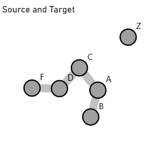
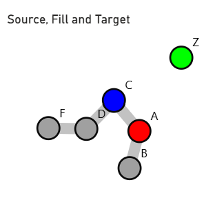

# Constellation

A Power BI custom visual for highlighting the interconnectedness of data

## How does it work

The core of the this solution is the ability to visualize networks of nodes simply using an [adjacency list](https://en.wikipedia.org/wiki/Adjacency_list) listed as a table. For example when you pass in this table:

| Source | Target |
| ---    | ---    |
| A      | B      |
| A      | C      |
| C      | D      |
| D      | F      |
| Z      | null   |

You receive this graph:

Notice how even though both `B` and `F` are never listed in the "Source" column, they are visible in the final visual.

The visual also allows for conditional formatting, thought it is implemented in an unsual way, for example if I wanted to change the color of the Source node I could add a column called "Fill" then add it to the "Source Fill" box of the dashboard:

| Source | Target | Fill      |
| ---    | ---    | ---       |
| A      | B      | #ff0000 |
| A      | C      | null |
| C      | D      | #0000ff |
| D      | F      | null      |
| Z      | null   | #00ff00 |

When a source node has multiple color values, such as here:

| Source | Target | Fill      |
| ---    | ---    | ---       |
| A      | B      | #ff0000 |
| A      | C      | #00ff00 |

the first color value present will be chosen, this can lead to unexpected behaviour and should be avoided.

The priority is:

 1. Value passed the visual
 2. Formatting pane parameter
 3. Reasonable default value

This means that in the visual described in the table above, the value of the node `A` will be `#ff0000` but the color of `D` will be first interpreted as `null` which means if falls throught to the value of the formatting pane parameter, if the formatting pane parameter was invalid it would then fall throught into the default value of `#9D00FF`.
